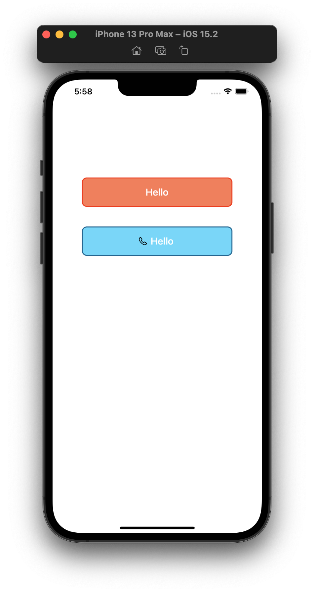

Swifty-Views
========================

[](https://developer.apple.com/iphone/index.action)
[](https://developer.apple.com/swift)
[](http://mit-license.org)
[](https://github.com/dekatotoro/SlideMenuControllerSwift/issues?state=open)


iOS Views for all kinds of use. Hehehe.



## Installation

No install procedure exists for this repository at this moment.
Coming soon.

## Usage

<ol>
<li>Open ```ViewController.swift```</li>
<li>See the format of adding the views</li>
<li>Duplicate desired view from the ./Models folder</li>
</ol>


## Requirements
Requires Swift5.0 and iOS 12.0.


## Features
- Highly customizable
- Complete example


## Contributing
Forks, patches and other feedback are welcome.

## Creator
[Syed Zohair](https://github.com/zohairhadi)


## License
SwiftyViews is available under the MIT license. See the [LICENSE](./LICENSE) file for more info.
