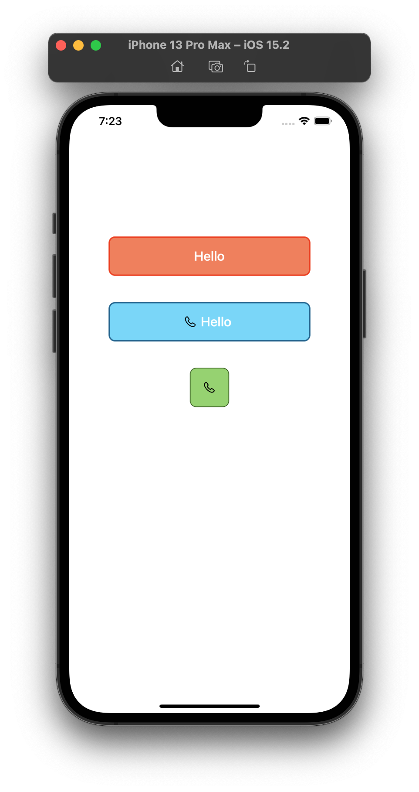

# Swifty-Views

[](https://developer.apple.com/iphone/index.action)
[](https://developer.apple.com/swift)
[](http://mit-license.org)

iOS Views for all kinds of use. Hehehe.



## Installation

No install procedure exists for this repository at this moment.
Coming soon.

## Usage

<ol>
<li>Open ```ViewController.swift```</li>
<li>See the format of adding the views</li>
<li>Copy and paste the desired view from the ./Models folder into your project</li>
</ol>

## Requirements

Requires Swift5.0 and iOS 12.0.

## Features

### Buttons
- Highly customizable
- Complete example

### Forms
Take a look at the following repo for forms: https://github.com/neoneye/SwiftyFORM

## Contributing

Forks, patches and other feedback are welcome.

## Creator

[Syed Zohair](https://github.com/zohairhadi)

## License

SwiftyViews is available under the MIT license. See the [LICENSE](./LICENSE) file for more info.
